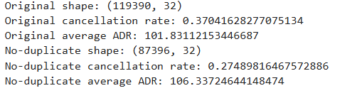
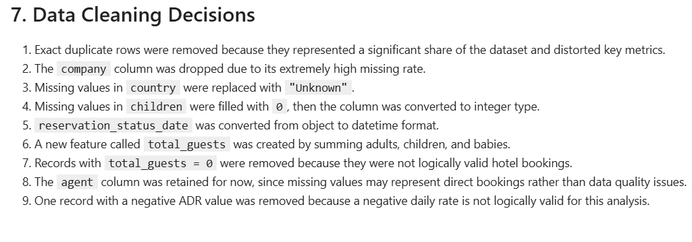
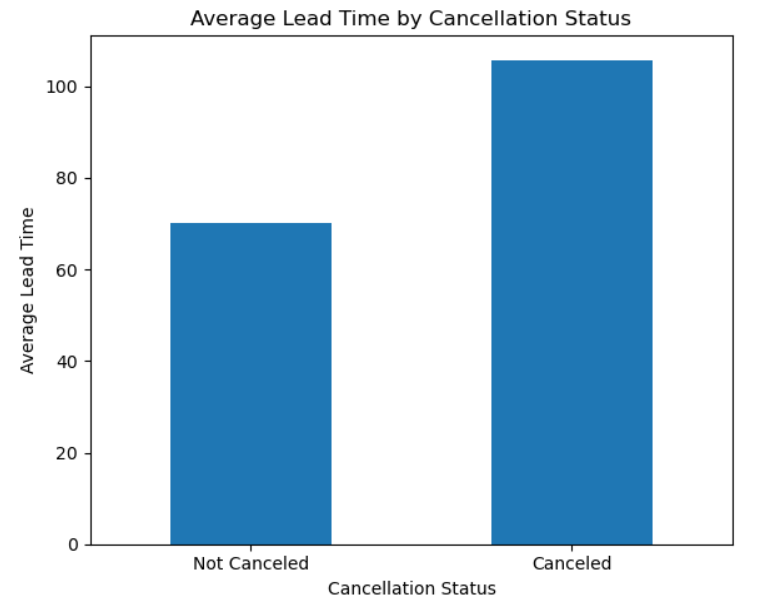

# Hotel Booking Data Analysis

## Project Overview
In this project, I aimed to understand booking behavior by analyzing a hotel booking dataset. Before the analysis, I examined the dataset and addressed data quality issues such as missing values, duplicate records, and inconsistent data. After that, through exploratory data analysis (EDA), I identified key metrics such as cancelled reservations, seasonal reservation trends, market segments, average daily price, and lead time. At the end of the analysis, by interpreting the findings, I identified key insights into reservation behavior.

## Dataset
The dataset contains approximately 120.000 hotel booking records. The dataset includes many variables such as reservation dates, market segment, ADR, reservation status, cancellation status, and so on. The dataset includes both city hotels and resort hotels.

## Business Questions
- Which hotel type has the highest cancellation rate?
- During which season do bookings peak?
- Does the likelihood of cancellation increase as the lead time increases?
- How do cancellation rates vary across market segments?
- How is the Average Daily Rate (ADR) distributed?
- Which months receive the highest number of bookings?
- How often does the assigned room type differ from the reserved room type?
- What are the main characteristics of canceled bookings compared to non-canceled bookings?

## Data Cleaning
1. Exact duplicate rows were removed because they represented a significant share of the dataset and distorted key metrics.
2. The `company` column was dropped due to its extremely high missing rate.
3. Missing values in country were replaced with "Unknown" to preserve the records while explicitly indicating unavailable information.
4. Missing values in `children` were filled with `0`, then the column was converted to integer type.
5. `reservation_status_date` was converted from object to datetime format.
6. A new feature called `total_guests` was created by summing adults, children, and babies.
7. Records with `total_guests = 0` were removed because they were not logically valid hotel bookings.
8. The `agent` column was retained for now, since missing values may represent direct bookings rather than data quality issues.
9. One record with a negative ADR value was removed because a negative daily rate is not logically valid for this analysis.
10. Final validation checks were performed to confirm that no missing values, duplicate records, or logically invalid observations remained in the cleaned dataset.

![Final_validations(images/Final_validations.PNG)
## Exploratory Data Analysis
1. Cancellation Rate by Hotel Type
2. Booking Distribution by Season
3. Cancellation Rate by Market Segment
4. Average Lead Time by Cancellation Status
5. Distribution of ADR
6. Distribution of ADR (Bookings with ADR < 500) *(for better visualization)*
   
## Key Insights
- City Hotel showed a higher cancellation rate than Resort Hotel, suggesting less stable booking behavior.
- Booking demand showed a seasonal pattern, with the highest volume in summer and the lowest in winter.
- Cancellation patterns differed across market segments. While `Undefined` showed a 100% cancellation rate, it only contained two bookings and was therefore not considered a meaningful pattern.
- `Online TA` emerged as one of the most important market segments due to its high booking volume and relatively high cancellation rate.
- Canceled bookings had a longer average lead time than non-canceled bookings, indicating that reservations made further in advance were more likely to be canceled.
  
- ADR values were concentrated mostly in the lower-to-mid price range, with a right-skewed distribution and a small number of high-value bookings.
  
## Tools Used
- Python
- Pandas
- Matplotlib
- Jupyter Notebook
